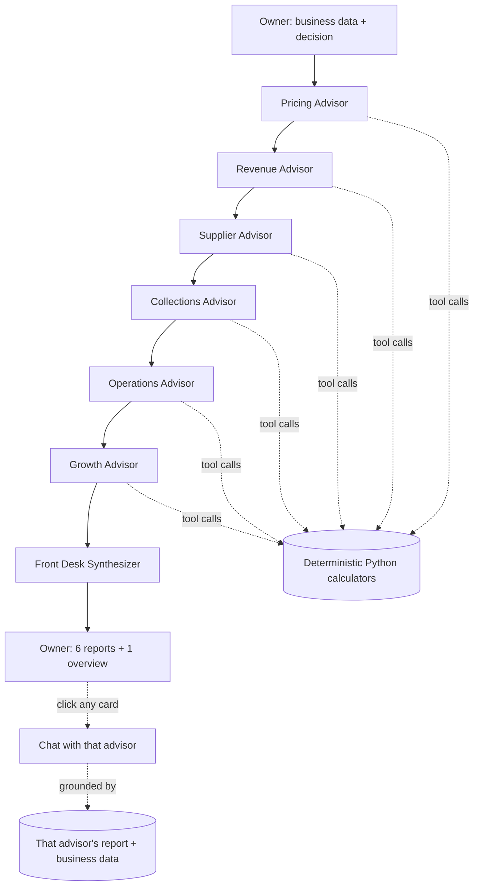

# GEMMA-6: One Model, Six Advisors
### Content Source Document — for PPT / Kaggle Submission

This document contains all the written content for the project, organized so each section maps
roughly to one or two slides. Copy sections directly into slides; the "Speaker notes" under each
section are for the presenter, not the slide itself.

---

## 1. Title Slide

**GEMMA-6**
*One Gemma model. Six specialist advisors. Zero invented numbers.*

An AI business advisory tool for SMEs — pricing, revenue forecasting, supplier management,
collections, operations, and growth strategy — powered entirely by Gemma running locally.

Track: Gemma SME Growth & Advisory Agent

---

## 2. The Problem

Small and medium business owners make high-stakes decisions — raise a price, take a big order,
switch a supplier — without the analyst bench a large company has. Generic chatbots can *talk*
about these decisions, but two things make them unsafe to actually act on:

1. **They guess at numbers.** Ask an LLM "what will my revenue be if I raise prices 10%?" and it
   will confidently produce a number it invented. For a business owner deciding whether to make
   payroll, an invented cash-flow figure is the failure case, not a minor quirk.
2. **They give one flat answer**, when a real decision — raise the price, take the contract,
   switch the supplier — touches pricing, cash flow, suppliers, operations, and long-term
   positioning all at once, and those angles can disagree with each other.

**Speaker notes:** open with the invented-number failure mode — it's the single clearest way to
make the audience feel the stakes of "just trust the AI."

---

## 3. The Idea

Don't ask one model to be a generalist advisor. Give it **six narrow roles**, run them **one at a
time**, and force every number that comes out of any of them to be **traceable to a real
calculation**, not a guess.

> The model reasons. Tools compute.

Six advisors, one shared model, sequential passes:

| Advisor | Lane |
|---|---|
| **Pricing** | Price elasticity, customer segment impact, churn risk |
| **Revenue Forecasting** | 6-month projection, decision vs. status quo, ranges not points |
| **Supplier** | Contract/renegotiation risk, single-supplier exposure |
| **Collections** | Days-to-pay shift, late-payment risk by segment |
| **Operations** | Capacity, inventory reorder needs, stockout risk |
| **Growth** | Competitive positioning, cannibalization, moat |

A seventh pass — the **Front Desk** — reads all six reports and answers the owner directly,
surfacing disagreements between advisors instead of quietly picking one.

**Speaker notes:** emphasize "one model" — this isn't six different models or six API keys, it's
one Gemma instance reloaded with a different role each pass. That's what makes it runnable on a
single device.

---

## 4. Why One Model at a Time (the device constraint)

A real SME's laptop, or a hackathon demo machine, holds **one language model in memory**. That
single fact shaped the whole architecture:

- Advisors run **sequentially**, never in parallel.
- A single **lock** guards every generation — two requests can never hit the model at once and
  thrash the device.
- Each advisor's output is written to **disk** as a Markdown report, then the advisor "exits."
  Nothing stays resident. **The report on disk is the memory** — there is no long-lived agent
  process for six specialists to keep alive.
- Interactive chat (see §7) reloads a role's prompt + its own report on demand rather than keeping
  a persistent conversation agent per advisor.

**Speaker notes:** this section answers the obvious skeptical question — "isn't sequential slower
than parallel agents?" Yes, and that's the point: it's what makes the whole thing work on one
consumer device instead of needing six GPUs or six API budgets.

---

## 5. The Grounding Guarantee (the credibility story)

This is the single most important slide in the deck — it's the difference between a demo and
something a business owner could actually act on.

**The rule:** the model never does arithmetic. Every derived number — a margin, a demand
projection, a days-sales-outstanding shift, a capacity utilization — comes from a **deterministic
Python function**, not from the model's imagination.

How it works end to end:

1. An advisor decides it needs a number it doesn't already have.
2. It emits a structured tool call (e.g. `price_elasticity_impact(current_price=2.50,
   new_price=2.75, base_demand=20000, elasticity=0.2)`).
3. A plain Python function computes the answer — same inputs, same output, every time.
4. The result comes back tagged with its **formula and inputs**, not just a bare number.
5. The advisor's report cites that exact call in its Numbers section.

If a number isn't available and no tool can produce it, the advisor is instructed to write it
under **Open Questions** — never to guess. This turns "I don't have that data" into a structured,
visible signal instead of a silent hallucination.

**Real example, captured live from a test run** (Pricing Advisor, bakery scenario):

```
## Numbers
- get_metric("business.monthly_revenue") -> 20000
- get_metric("business.unit_cost") -> 2.5
- price_elasticity_impact(current_price=2.5, new_price=2.75,
  base_demand=20000, elasticity=0.2) -> 20400.0 units
- price_elasticity_impact(...) -> 6100.0 revenue_change
```

Every one of those four lines traces to a real function call, not a guess.

**Speaker notes:** if you only have time to explain one technical decision to judges, explain this
one. It's also the answer to "how is this different from just prompting ChatGPT for business
advice."

---

## 6. Architecture

```
GemmaRunner        one model, locked, backend-swappable (Ollama local by default)
Advisors           shared base prompt + six role blocks + one fixed report schema
Tools              13 deterministic calculators, mapped per advisor, "model reasons, tools compute"
ReportStore        business_context.json + six {advisor}.md reports on disk
Orchestrator       runs the six advisors in sequence, then the Front Desk synthesis
FrontDesk          reads all six reports, synthesizes overview + answers general questions
Routes             FastAPI HTTP surface (polling, no WebSocket/SSE complexity)
```

**The pipeline, end to end:**

```
Owner submits: business data + "the decision under test"
        │
        ▼
   Pricing ──▶ Revenue ──▶ Supplier ──▶ Collections ──▶ Operations ──▶ Growth
   (each advisor: prompt + own tools + business data → tool-call loop → report.md)
        │
        ▼
   Front Desk reads all six reports.md → writes overview.md
        │
        ▼
   Owner sees six reports + one synthesis, can chat with any single advisor
```

**Stack:**
- **Model:** Gemma 3 (4B), served locally via Ollama — no network dependency on stage.
- **Backend:** Python, FastAPI, plain sequential orchestration (no external agent-framework
  dependency required to run this).
- **Frontend:** React + TypeScript + Tailwind, polling-based status updates (1.5s interval) —
  chosen over WebSockets/SSE for demo-day reliability.
- **Persistence:** flat Markdown files + JSON on disk. No database. The filesystem *is* the state
  store.

**Speaker notes:** if judges ask "why not LangGraph / a proper agent framework" — the honest
answer is: it was considered (a full state-graph design with a SQLite checkpointer exists in the
original design doc for resuming across model reloads), but for a live demo, the plain sequential
loop has fewer moving parts and fewer ways to fail on stage. That's a deliberate scope cut, not an
oversight.

---

## 7. Interactive Chat — Talk to Any Advisor

Once an advisor's report lands, the owner can click into it and ask follow-up questions —
"why did you flag this segment?", "what if I only raised the price 5%?"

Under the hood: the system reloads that advisor's role prompt + its own report as grounding
context, and the same tool-calling loop is available inside chat — so a follow-up question that
needs a new calculation (e.g. "run the churn numbers for 8,000 customers instead") still goes
through a real tool call, not a guessed answer.

A **Front Desk chat** is also available for general questions ("should I go ahead with this
decision?") — it answers only from what the six reports say, names which advisor said what, and
explicitly surfaces disagreements between advisors rather than picking a side silently.

**Speaker notes:** this is a good place to run a live click-through if the demo allows it — it's
the most tangible "this isn't just six blocks of static text" moment.

---

## 8. The Degraded-State Pattern

One model in memory means only one generation can run at a time. Rather than letting a chat
request block indefinitely while the six-advisor run is still in progress, the backend returns an
explicit **busy** status (`503`), and the frontend shows "Advisors are still thinking" instead of
hanging.

**Why this matters:** it's a small design choice with an outsized effect on trust — the system
tells the user its real state instead of pretending to be responsive. This is the same principle
applied twice: once for tool-call grounding (say "I don't know" instead of guessing a number), and
once for concurrency (say "I'm busy" instead of hanging).

---

## 9. The Frontend

A landing page in the visual language of modern developer-infrastructure products (dark canvas,
serif display headline, single accent color used sparingly, product-mockup preview in the hero) —
deliberately not a form-first "enter your business data" page, because the first thing a visitor
should understand is *what this tool guarantees*, not how to operate it.

Flow: **Landing → Get Started → Dashboard**

- **Dashboard:** pick a preset scenario (bakery, retail store, small manufacturer) or enter your
  own decision + business data. Six advisor cards show live progress (waiting → running → done) as
  the sequential pipeline executes, polling the backend every 1.5 seconds.
- **Chat view:** click any completed advisor card to open a two-panel view — conversation on the
  left, that advisor's full Markdown report on the right, always visible side by side so a chat
  answer can be checked against its source report in the same glance.

**Speaker notes:** mention that this was iterated live — the first pass had a UI bug where the
chat input could be pushed off-screen by a tall report, caught and fixed during testing before the
final version.

---

## 10. Demo Script (3–4 minutes)

1. **Landing page** — one line on the guarantee: "this tool never invents a number."
2. **Get Started → pick the bakery preset** — decision: "raise the sourdough price 10%."
3. **Run Analysis** — six cards light up in sequence: Pricing → Revenue → Supplier → Collections →
   Operations → Growth → Front Desk.
4. **Open the Pricing report** — point at the Numbers section, show that each figure cites the
   tool call and formula behind it.
5. **Ask a follow-up in chat** — "Which segment should I worry about most?" — show the grounded,
   conversational answer.
6. **Open the Front Desk overview** — show the synthesis correctly flagging a real disagreement
   between two advisors (e.g. Revenue projecting growth while Growth flags cannibalization risk).
7. **Close** on the one-line pitch: one model, six lanes, every number traceable.

---

## 11. What Makes This Different (differentiation slide)

- **Zero-hallucination numbers, structurally enforced** — not a prompt instruction that can be
  ignored, but a code path: the model can only emit numbers that either exist in the source data or
  came back from a logged function call.
- **Runs on one consumer device** — Gemma via Ollama, no cloud API dependency, no per-token cost,
  works offline. Relevant for SMEs with poor connectivity, and for a live demo with no network risk.
- **Disagreement is a feature, not a bug** — the Front Desk is instructed to surface when two
  advisors point in different directions rather than silently averaging them into a bland answer.
- **A report is the memory** — no long-lived agent state to manage, debug, or lose; the disk-backed
  design means the same report is available to the dashboard, the notes panel, and chat with no
  duplication.

---

## 12. Architecture Diagram (for a slide image)



---

## 13. Future Work (optional closing slide)

- Fine-tune / LoRA adapter per advisor role for tighter domain tone.
- Multilingual output (Gemma handles this reasonably well) for non-English-first SME owners.
- Voice input for owners who prefer speaking over typing.
- A resumable state-graph version (LangGraph + SQLite checkpointer) if the run needs to survive a
  model reload mid-analysis — designed but deliberately deferred for this build to keep the demo
  simple and reliable.

---

## Appendix: Key Facts Checklist (for slide footers / speaker cheat sheet)

- Model: **Gemma 3, 4B parameters**, served locally via **Ollama**.
- 6 advisor roles + 1 synthesizer, **strictly sequential** (one model in memory at a time).
- **13 deterministic tool functions** across pricing, revenue, supplier, collections, operations,
  and growth — every derived number traces to one of these.
- Backend: **FastAPI** (Python). Frontend: **React + TypeScript + Tailwind**.
- Persistence: flat **Markdown reports + JSON** on disk — no database.
- Status updates via **polling** (1.5s interval) — no WebSocket/SSE dependency for the demo.
- 3 ready-to-run demo scenarios: neighborhood bakery, retail apparel store, small manufacturer.
